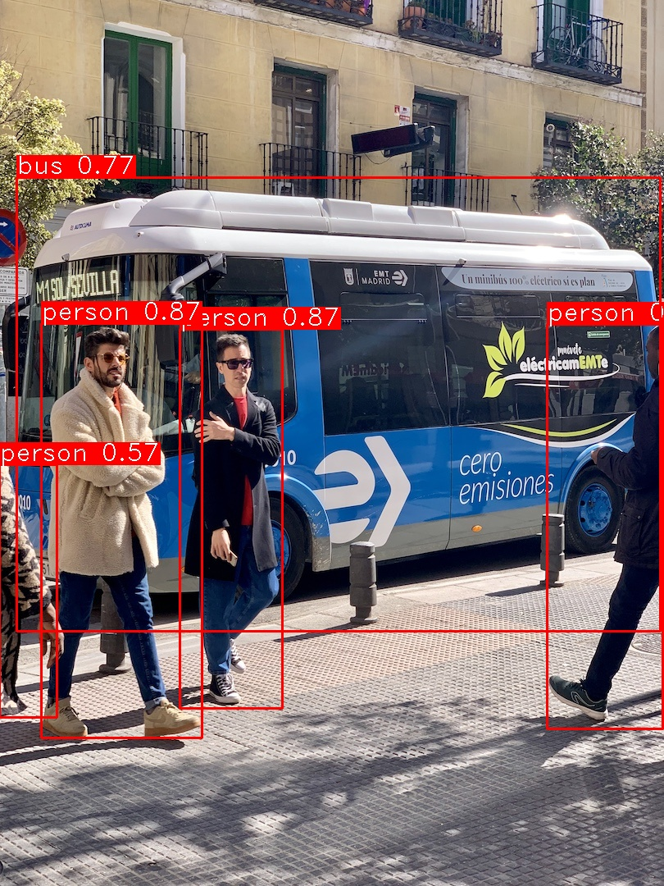
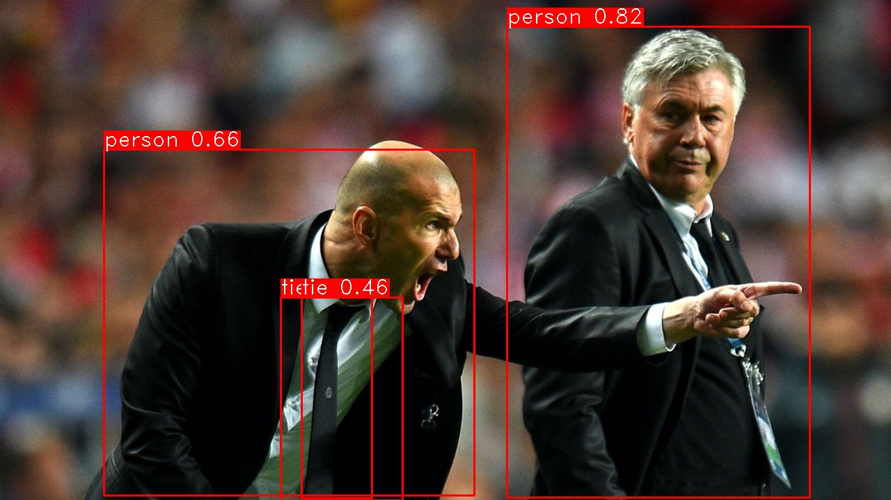

## Introduction

A LibTorch inference implementation of the [yolov5](https://github.com/ultralytics/yolov5) object detection algorithm. Both GPU and CPU are supported.


## Dependencies

- Ubuntu 16.04
- CUDA 10.2
- OpenCV 3.4.12
- LibTorch 1.6.0


## TorchScript Model Export

Please refer to the official document here: https://github.com/ultralytics/yolov5/issues/251


**Mandatory Update**: developer needs to modify following code from the original [export.py in yolov5](https://github.com/ultralytics/yolov5/blob/master/models/export.py)

```bash
# line 29
model.model[-1].export = False
```


**Add GPU support**: Note that the current export script in [yolov5](https://github.com/ultralytics/yolov5) **uses CPU by default**,  the "export.py" needs to be modified as following to support GPU:

```python
# line 28
img = torch.zeros((opt.batch_size, 3, *opt.img_size)).to(device='cuda')  
# line 31
model = attempt_load(opt.weights, map_location=torch.device('cuda'))
```


Export a trained yolov5 model:

```bash
cd yolov5
export PYTHONPATH="$PWD"  # add path
python models/export.py --weights yolov5s.pt --img 640 --batch 1  # export
```


## Setup

```bash
$ cd /path/to/libtorch-yolo5
$ wget https://download.pytorch.org/libtorch/cu102/libtorch-cxx11-abi-shared-with-deps-1.6.0.zip
$ unzip libtorch-cxx11-abi-shared-with-deps-1.6.0.zip
$ mkdir build && cd build
$ cmake .. && make
```


To run inference on examples in the `./images` folder:

```bash
# CPU
$ ./libtorch-yolov5 --source ../images/bus.jpg --weights ../weights/yolov5s.torchscript.pt --view-img
# GPU
$ ./libtorch-yolov5 --source ../images/bus.jpg --weights ../weights/yolov5s.torchscript.pt --gpu --view-img
# Profiling
$ CUDA_LAUNCH_BLOCKING=1 ./libtorch-yolov5 --source ../images/bus.jpg --weights ../weights/yolov5s.torchscript.pt --gpu --view-img
```


## Demo







## FAQ

1. terminate called after throwing an instance of 'c10::Error' what(): isTuple() INTERNAL ASSERT FAILED
   
- Make sure "model.model[-1].export = False" when running export script.
  
2. Why the first "inference takes" so long from the log?

   - The first inference is slower as well due to the initial optimization that the JIT (Just-in-time compilation) is doing on your code. This is similar to "warm up" in other JIT compilers. Typically, production services will warm up a model using representative inputs before marking it as available.

   - It may take longer time for the first cycle. The [yolov5 python version](https://github.com/ultralytics/yolov5) run the inference once with an empty image before the actual detection pipeline. User can modify the code to process the same image multiple times or process a video to get the valid processing time.


## References

1. https://github.com/ultralytics/yolov5
2. [Question about the code in non_max_suppression](https://github.com/ultralytics/yolov5/issues/422)
3. https://github.com/walktree/libtorch-yolov3
4. https://pytorch.org/cppdocs/index.html
5. https://github.com/pytorch/vision
6. [PyTorch.org - CUDA SEMANTICS](https://pytorch.org/docs/stable/notes/cuda.html)
7. [PyTorch.org - add synchronization points](https://discuss.pytorch.org/t/why-is-the-const-time-with-fp32-and-fp16-almost-the-same-in-libtorchs-forward/45792/5)
8. [PyTorch - why first inference is slower](https://github.com/pytorch/pytorch/issues/2694)

